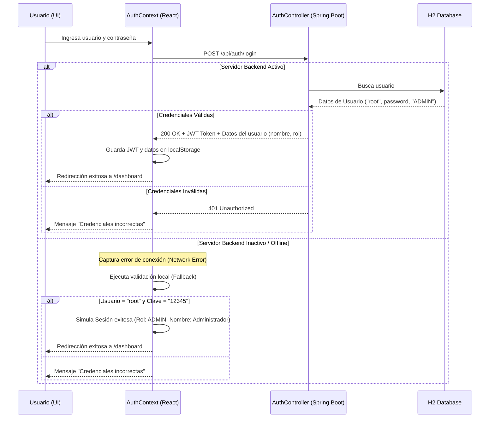

# ProFact — Sistema de Facturación y Administración Inteligente

Este repositorio contiene la estructura completa del proyecto **ProFact**, refactorizado y organizado bajo una arquitectura **monolítica modular** que divide de forma limpia la interfaz de usuario (Frontend) y la lógica de negocio junto con la persistencia (Backend).

---

## 📂 Estructura General del Proyecto

El proyecto está dividido en dos directorios principales en la raíz:

```
PROYECTO-DISEÑO-NUEVO/
├── frontend/                   # Aplicación de interfaz (React + Vite + TypeScript)
├── backend/                    # API de servicios (Java Spring Boot + Maven + JPA + H2)
└── README.md                   # Documentación del proyecto (este archivo)
```

---

## 💻 1. Módulo Frontend (`/frontend`)

El frontend está desarrollado bajo estándares modernos de desarrollo web móvil y de escritorio, enfocado en velocidad, tipografía clara y diseño interactivo.

### Stack Tecnológico
*   **Core:** [React 19](https://react.dev/) con [TypeScript](https://www.typescriptlang.org/) para un tipado estricto y seguro.
*   **Herramienta de Compilación (Bundler):** [Vite 8](https://vite.dev/) para builds ultra rápidos.
*   **Enrutado:** [React Router 7](https://reactrouter.com/) con rutas protegidas según estado de sesión.
*   **Gestión de Estado:** React Context API (`AuthContext`) para control de sesión e información del usuario.
*   **Estilos:** CSS Vanilla estructurado con variables globales y animaciones fluidas.

### Módulos y Pantallas del Frontend

1.  **Páginas Públicas (Landing):**
    *   `InicioLanding.tsx`: Página principal con presentación de servicios y beneficios.
    *   `Nosotros.tsx`: Información corporativa sobre el equipo y visión de ProFact.
    *   `Planes.tsx`: Detalle de los distintos planes comerciales (Básico, Premium, etc.).
    *   `Capacitacion.tsx`: Información sobre cursos y formación para clientes.
    *   `Sesion.tsx`: Formulario de login interactivo con indicador de carga y enlace de retorno.

2.  **Panel de Administración (Dashboard - Rutas Protegidas):**
    *   `InicioDashboard.tsx`: Vista general con métricas de ventas, compras y estado de la empresa.
    *   `Ventas.tsx`: Administración y registro de transacciones de salida.
    *   `Compras.tsx`: Gestión y registro de adquisición de mercancía y facturas de proveedores.
    *   `Inventario.tsx`: Control de stock, alertas de mínimo y catálogo de productos.
    *   `Reportes.tsx`: Gráficos interactivos y resúmenes de rendimiento.
    *   `Usuarios.tsx`: Gestión de permisos de usuarios internos en la empresa.

---

## ☕ 2. Módulo Backend (`/backend`)

El backend provee servicios REST seguros que manejan la lógica empresarial, autenticación y persistencia de datos.

### Stack Tecnológico
*   **Framework principal:** [Spring Boot 3.3.0](https://spring.io/projects/spring-boot) (Java 21).
*   **Gestión de Dependencias:** [Maven](https://maven.apache.org/) (incluye wrapper `mvnw` para autodescarga).
*   **Seguridad:** [Spring Security 6](https://spring.io/projects/spring-security) con soporte para Stateless Session.
*   **Generación de Tokens:** [JJWT (Java JWT)](https://github.com/jwtk/jjwt) para tokens JSON Web estructurados.
*   **Persistencia:** Spring Data JPA + Hibernate para mapeo objeto-relacional.
*   **Base de Datos:** [H2 Database](https://www.h2database.com/) (base de datos relacional integrada en modo archivo persistente).

### Características Clave del Backend

1.  **Controlador de Autenticación (`AuthController.java`):**
    *   Expone el endpoint `POST /api/auth/login`.
    *   Permite el acceso CORS desde el frontend (`http://localhost:5173`).
    *   Valida credenciales y genera un token JWT firmado.

2.  **Seguridad y Filtro JWT (`JwtAuthFilter.java` & `SecurityConfig.java`):**
    *   Usa un filtro personalizado que intercepta peticiones HTTP para extraer el token en la cabecera `Authorization: Bearer <token>`.
    *   Autentica al usuario en el contexto de Spring Security.
    *   Permite acceso sin token a la consola H2 (`/h2-console`) y al endpoint de login (`/api/auth/login`).

3.  **Persistencia y Datos Iniciales (`DataInitializer.java`):**
    *   Base de datos configurada en archivo local `./data/profactdb` para que la información se conserve al apagar el servidor.
    *   En el primer arranque, la aplicación inicializa la base de datos de manera automática e inserta el usuario administrador por defecto (`root` con clave `12345`).

---

## 🔐 3. Flujo de Autenticación y Fallback Local

Para garantizar la estabilidad en entornos de desarrollo local y permitir que los diseñadores frontend sigan trabajando aunque el servidor Java esté inactivo, la aplicación implementa un sistema de **conmutación por error (fallback)**:



---

## 🚀 4. Guía de Ejecución Paso a Paso

### Prerrequisitos
*   [Node.js](https://nodejs.org/) (versión 18 o superior)
*   [Java JDK](https://www.oracle.com/java/technologies/downloads/) (versión 21 o superior)

---

### Pasos para Ejecutar el Frontend

1.  Abre una terminal en la raíz del proyecto.
2.  Navega al directorio frontend:
    ```powershell
    cd frontend
    ```
3.  Instala las dependencias necesarias (solo la primera vez):
    ```powershell
    npm install
    ```
4.  Inicia el servidor de desarrollo:
    ```powershell
    npm run dev
    ```
5.  Abre tu navegador en: [http://localhost:5173](http://localhost:5173)

---

### Pasos para Ejecutar el Backend

1.  Abre una **segunda** terminal en la raíz del proyecto.
2.  Navega al directorio backend:
    ```powershell
    cd backend
    ```
3.  Ejecuta el servidor de Spring Boot usando el wrapper de Maven (se encargará de descargar Maven automáticamente si no lo tienes instalado):
    ```powershell
    .\mvnw.cmd spring-boot:run
    ```
4.  El backend se levantará en el puerto `8080`.

---

### Acceso a la Consola de la Base de Datos H2

Cuando el backend esté activo, puedes acceder a la consola de la base de datos para inspeccionar tablas y usuarios:

*   **URL de la Consola:** [http://localhost:8080/h2-console](http://localhost:8080/h2-console)
*   **JDBC URL:** `jdbc:h2:file:./data/profactdb`
*   **User Name:** `sa`
*   **Password:** *(Dejar vacío)*